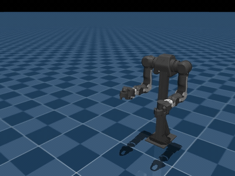
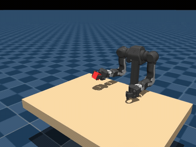
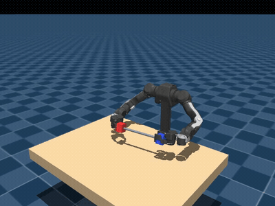
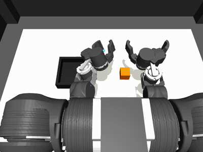
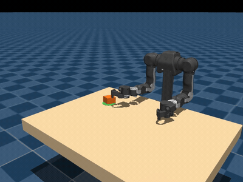
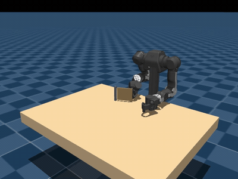
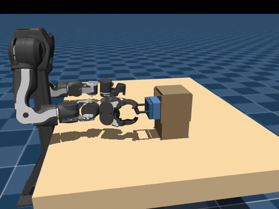
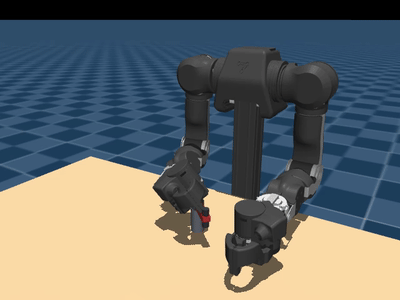

# OpenArm mjlab

PPO manipulation tasks for the [OpenArm](https://github.com/enactic/openarm) bimanual robot,
built on [mjlab](https://github.com/mujocolab/mjlab) (MuJoCo Warp + RSL-RL).

## Tasks

Choose a task from the table below and use its **Task Name** as the first argument
to `openarm-mjlab-train` or `openarm-mjlab-play`.

| Task Description | Task Name | Demo |
| --- | --- | --- |
| Reach a target position with the right gripper. | `OpenArm-Reach` |  |
| Grip a block with the right arm, lift it, and hold it above the table. | `OpenArm-Lift` |  |
| Grip both ends of a bar and lift it using both arms together. | `OpenArm-BimanualLift` |  |
| Pick the orange cube from the table with the left arm and place it in the black tray in the full OpenArm Cell scene. The right arm and lifter stay at home. | `OpenArm-PickPlace` |  |
| Push a puck into the goal area and leave it there. The Vision variant uses overhead depth-camera observations instead of privileged puck-position observations. | `OpenArm-Puck`<br>`OpenArm-Puck-Vision` |  |
| Grasp the handle and swing the door open. | `OpenArm-Door` |  |
| Grasp the handle and pull the drawer open. | `OpenArm-Drawer` |  |
| Grasp the lever and turn the valve. | `OpenArm-Valve` |  |

## Setup

```bash
git clone git@github.com:enactic/openarm_mjlab.git
cd openarm_mjlab
uv sync
```

## Train

Real training needs a Linux machine with a CUDA GPU:

```bash
uv run openarm-mjlab-train OpenArm-PickPlace \
  --env.scene.num-envs 4096 \
  --env.viewer.height 480 \
  --env.viewer.max-extra-envs 0 \
  --env.viewer.width 640 \
  --video True
```

CPU smoke test (e.g. on macOS):

```bash
CUDA_VISIBLE_DEVICES= uv run openarm-mjlab-train OpenArm-PickPlace \
  --env.scene.num-envs 4 \
  --agent.max-iterations 2
```

## Play a checkpoint

```bash
uv run openarm-mjlab-play OpenArm-PickPlace --checkpoint-file <path/to/checkpoint>
```

## Tests

```bash
uv run pytest
```

## License

Licensed under the Apache License 2.0. See [LICENSE](LICENSE) for details.

Copyright 2026 Enactic, Inc.

## Code of Conduct

All participation in the OpenArm project is governed by our [Code of Conduct](CODE_OF_CONDUCT.md).
